# P1_Probstat_E_5025201203
Praktikum 1 Probstat

# Identitas
Nama  : Syaiful Bahri Dirgantara
NRP   : 5025201203
Kelas : Probstat E

# Soal 1
Seorang penyurvei secara acak memilih orang-orang di jalan sampai dia bertemu dengan seseorang yang menghadiri acara vaksinasi sebelumnya.

  a.  Berapa peluang penyurvei bertemu x = 3 orang yang tidak menghadiri acara vaksinasi
      sebelum keberhasilan pertama ketika p = 0,20 dari populasi menghadiri acara vaksinasi ?
      (distribusi Geometrik)
  
  b.  mean Distribusi Geometrik dengan 10000 data random , prob = 0,20 dimana distribusi
      geometrik acak tersebut X = 3 ( distribusi geometrik acak () == 3 )
  
  c.  Bandingkan Hasil poin a dan b , apa kesimpulan yang bisa didapatkan?
  
  d.  Histogram Distribusi Geometrik , Peluang X = 3 gagal Sebelum Sukses Pertama
  
  e.  Nilai Rataan (μ) dan Varian (σ²) dari Distribusi Geometrik.
  
## 1.a
Berapa peluang penyurvei bertemu x = 3 orang yang tidak menghadiri acara vaksinasi
sebelum keberhasilan pertama ketika p = 0,20 dari populasi menghadiri acara vaksinasi ?
(distribusi Geometrik)

  
Pencarian peluang dilakukan dengan bantuan fungsi `dgeom(x-1, p)` sesuai dengan rumus pada distribusi geometrik. Namun karena p yang diketahui merupakan peluang yang mengadiri vaksinasi, sedangkan yang dicari adalah yang tidak mengikuti vaksinasi sehingga digunakan `dgeom(x-1, 1-p)`.
  
```R
#no 1.a
x = 3
prob = 0.20
P <- dgeom(x-1, 1-prob)
P
```
  
### Hasil
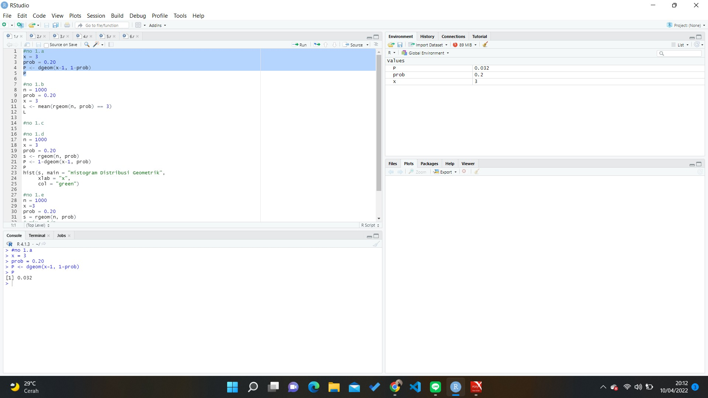
  
## 1.b
mean Distribusi Geometrik dengan 10000 data random , prob = 0,20 dimana distribusi
geometrik acak tersebut X = 3 ( distribusi geometrik acak () == 3 )
 
Mengenerate data random menggunakan `rgeom(n, p)`.
  
```R
#no 1.b
n = 1000
prob = 0.20
x = 3
L <- mean(rgeom(n, prob) == 3)
L
```
  
### Hasil
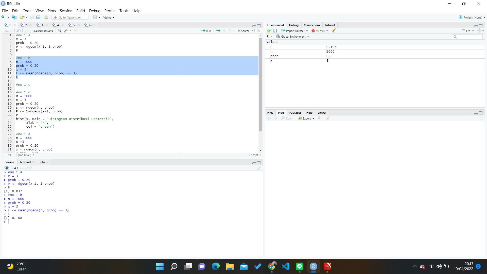
  
## 1.c
Bandingkan Hasil poin a dan b , apa kesimpulan yang bisa didapatkan?

Kesimpulan yang saya dapatkan adalah :

* Hasil 1.a bernilai tetap, sedangkan 1.b tidak tetap
* Meskipun demikian, perbedaan hasilnya cukup dekat

## 1.d
Histogram Distribusi Geometrik , Peluang X = 3 gagal Sebelum Sukses Pertama
  
Histogram dibuat dengan fungsi `hist()`. Sebelum membuat histogram, data harus digenerate secara random dahulu menggunakan `rgeom(n, p)`.
  
```R
#no 1.d
n = 1000
x = 3
prob = 0.20
s <- rgeom(n, prob)
P <- 1-dgeom(x-1, prob)
P
hist(s, main = "Histogram Distribusi Geometrik", 
     xlab = "x", 
     col = "green")
```
  
### Hasil
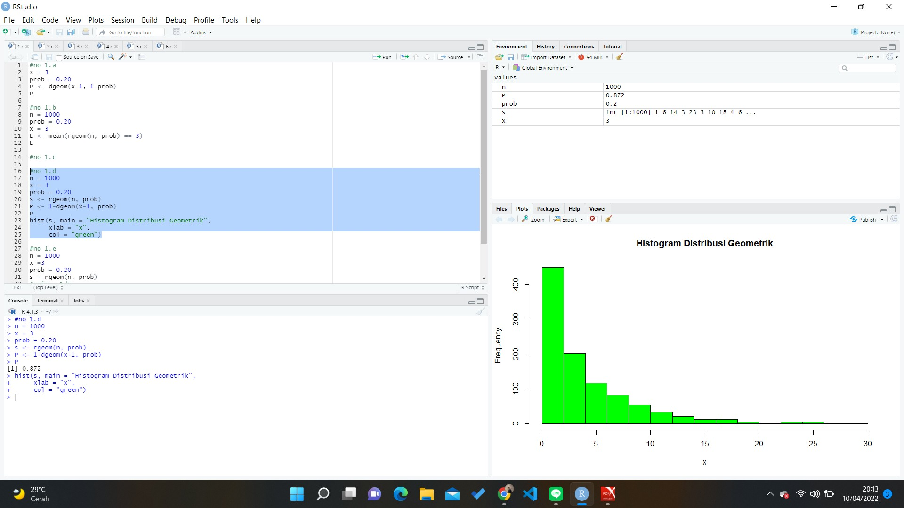
  
## 1.e
Nilai Rataan (μ) dan Varian (σ²) dari Distribusi Geometrik.
  
Dalam distribusi geometrik, `μ = 1/p` dan `σ² = (1-p)/(p^2)`.
  
```R
#no 1.e
n = 1000
x =3
prob = 0.20
s = rgeom(n, prob)
# miu = 1/p
miu = 1/prob
miu
# taw^2 = (1-p)/(p^2)
variance = (1-prob)/(prob^2)
variance
```
### Hasil
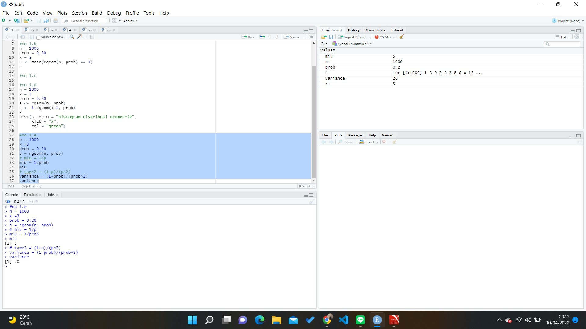
  
# Soal 2
Terdapat 20 pasien menderita Covid19 dengan peluang sembuh sebesar 0.2. Tentukan :

  a. Peluang terdapat 4 pasien yang sembuh.
  
  b. Gambarkan grafik histogram berdasarkan kasus tersebut.
  
  c. Nilai Rataan (μ) dan Varian (σ²) dari DistribusiBinomial.

## 2.a
Peluang terdapat 4 pasien yang sembuh.

```R
#no 2.a
n = 20
prob = 0.2
x = 4
P <- dbinom(x, n, prob)
P
```

### Hasil


## 2.b
Gambarkan grafik histogram berdasarkan kasus tersebut.

```R
#no 2.b
n = 20
prob = 0.2
x = 4
s <- rbinom(x, n, prob)
hist(s, main = "Histogram Kasus Covid19", 
     xlab = "x", 
     col = "pink")
```

### Hasil
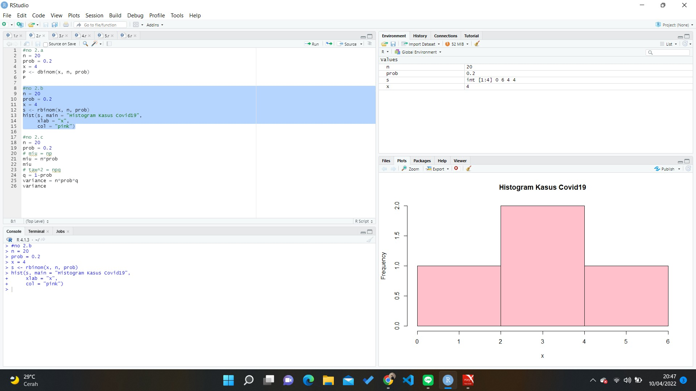

## 2.c
Nilai Rataan (μ) dan Varian (σ²) dari DistribusiBinomial.

Dalam distribusi binomial, `μ = np` dan `σ² = npq`.

```R
#no 2.c
n = 20
prob = 0.2
# miu = np
miu = n*prob
miu
# taw^2 = npq
q = 1-prob
variance = n*prob*q
variance
```

### Hasil
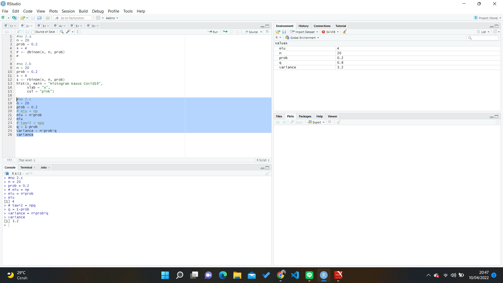

# Soal 3
Diketahui data dari sebuah tempat bersalin di rumah sakit tertentu menunjukkan rata-rata historis
4,5 bayi lahir di rumah sakit ini setiap hari. (gunakan Distribusi Poisson)

  a. Berapa peluang bahwa 6 bayi akan lahir di rumah sakit ini besok?

  b. simulasikan dan buatlah histogram kelahiran 6 bayi akan lahir di rumah sakit ini selama
  setahun (n = 365)

  c. dan bandingkan hasil poin a dan b , Apa kesimpulan yang bisa didapatkan

  d. Nilai Rataan (μ) dan Varian (σ²) dari Distribusi Poisson.

## 3.a
Berapa peluang bahwa 6 bayi akan lahir di rumah sakit ini besok?

```R
#no 3.a
lamda = 4.5
x = 6
P <- dpois(x, lamda)
P
```

### Hasil
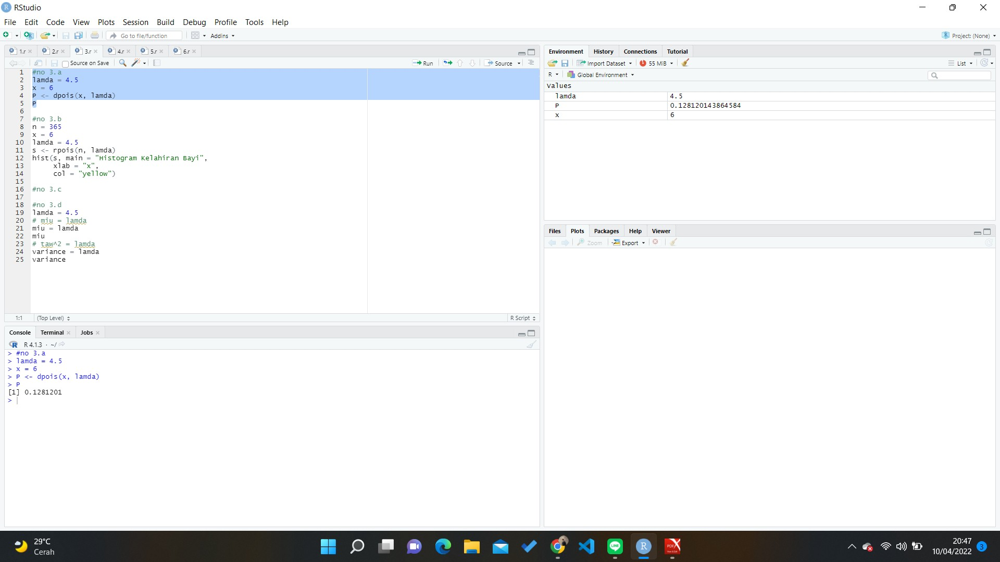

## 3.b
simulasikan dan buatlah histogram kelahiran 6 bayi akan lahir di rumah sakit ini selama
  setahun (n = 365)
  
Untuk mengenerate data kelahiran bayi digunakan fungsi `rpois(n, λ)` sesuai rumus pada distribusi Poisson.

```R
n = 365
x = 6
lamda = 4.5
s <- rpois(n, lamda)
hist(s, main = "Histogram Kelahiran Bayi", 
     xlab = "x", 
     col = "yellow")
```

### Hasil
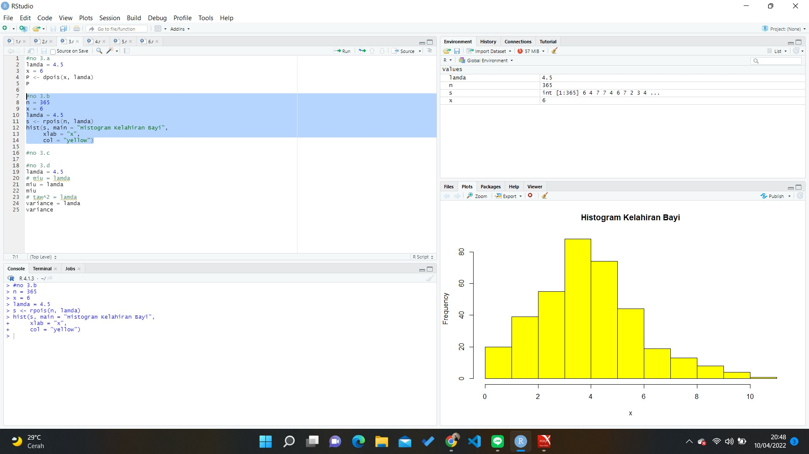

## 3.c
dan bandingkan hasil poin a dan b , Apa kesimpulan yang bisa didapatkan

Kesimpulan yang saya dapat adalah hasil poin a menyebabkan hasil pada poin b dengan x = 6 memiliki frekuensi sekitar 1/10 dari populasi.

## 3.d
Nilai Rataan (μ) dan Varian (σ²) dari Distribusi Poisson.

Dalam distribusi Poisson, `μ = λ` dan `σ² = λ`.

```R
#no 3.d
lamda = 4.5
# miu = lamda
miu = lamda
miu
# taw^2 = lamda
variance = lamda
variance
```

### Hasil
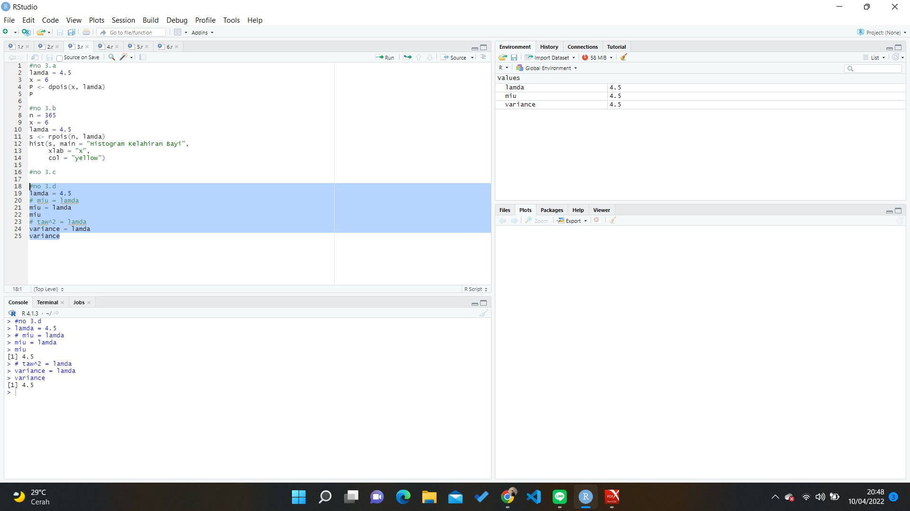

# Soal 4
Diketahui nilai x = 2 dan v = 10. Tentukan:

  a. Fungsi Probabilitas dari Distribusi Chi-Square.
  
  b. Histogram dari Distribusi Chi-Square dengan 100 data random.
  
  c. Nilai Rataan (μ) dan Varian (σ²) dari DistribusiChi-Square.

## 4.a
Fungsi Probabilitas dari Distribusi Chi-Square.

```R
#no 4.a
x =2
v = 10
P <- dchisq(x, v)
P
```

### Hasil
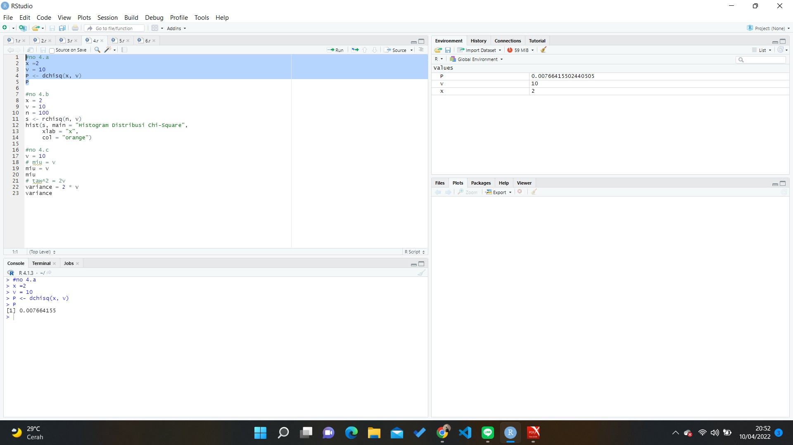

## 4.b
Histogram dari Distribusi Chi-Square dengan 100 data random.

Untuk mengenerate data random dalam distribusi Chi-Square digunakan fungsi yang sesuai, yaitu  `rchisq(n, v)`.

```R
#no 4.b
x = 2
v = 10
n = 100
s <- rchisq(n, v)
hist(s, main = "Histogram Distribusi Chi-Square",
     xlab = "x",
     col = "orange")
```

### Hasil
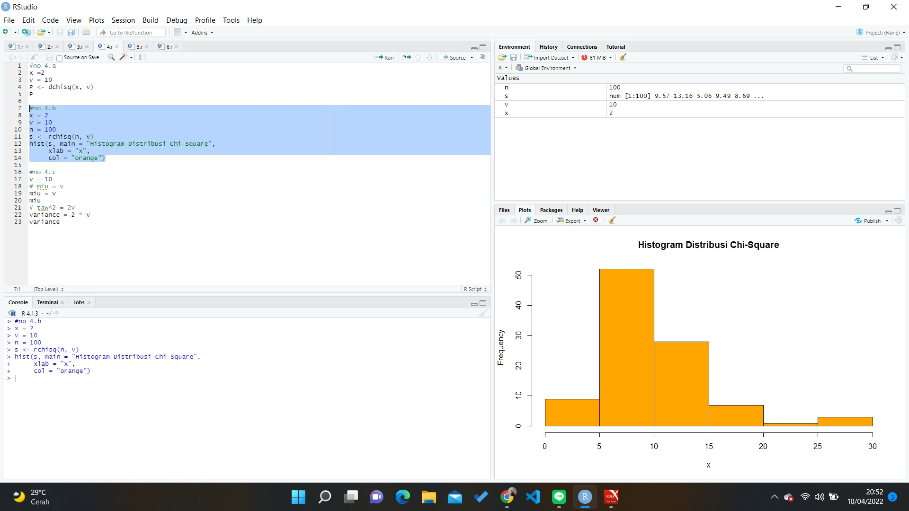

## 4.c
Nilai Rataan (μ) dan Varian (σ²) dari DistribusiChi-Square.

Dalam distribusi Chi-Square, `μ = v` dan `σ² = 2v`

```R
#no 4.c
v = 10
# miu = v
miu = v
miu
# taw^2 = 2v
variance = 2 * v
variance
```

### Hasil
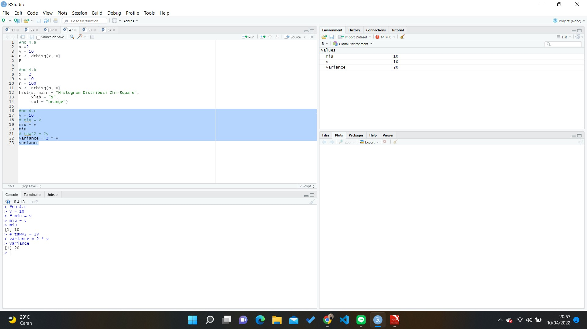

# Soal 5
Diketahui bilangan acak (random variable) berdistribusi exponential (λ = 3). Tentukan

  a. Fungsi Probabilitas dari Distribusi Exponensial

  b. Histogram dari Distribusi Exponensial untuk 10, 100, 1000 dan 10000 bilangan random

  c. Nilai Rataan (μ) dan Varian (σ²) dari Distribusi Exponensial untuk n = 100 dan λ = 3

## 5.a
Fungsi Probabilitas dari Distribusi Exponensial

```R
#no 5.a
lamda = 3
P <- dexp(lamda)
P
```

### Hasil
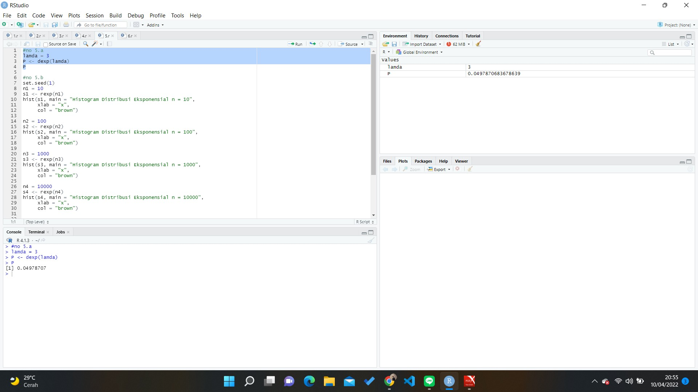

## 5.b
Histogram dari Distribusi Exponensial untuk 10, 100, 1000 dan 10000 bilangan random

Untuk mengenerate bilangan random pada distribusi Eksponensial digunakan fungsi `rexp(n)`.

```R
#no 5.b
set.seed(1)
n1 = 10
s1 <- rexp(n1)
hist(s1, main = "Histogram Distribusi Eksponensial n = 10",
     xlab = "x",
     col = "brown")

n2 = 100
s2 <- rexp(n2)
hist(s2, main = "Histogram Distribusi Eksponensial n = 100",
     xlab = "x",
     col = "brown")

n3 = 1000
s3 <- rexp(n3)
hist(s3, main = "Histogram Distribusi Eksponensial n = 1000",
     xlab = "x",
     col = "brown")

n4 = 10000
s4 <- rexp(n4)
hist(s4, main = "Histogram Distribusi Eksponensial n = 10000",
     xlab = "x",
     col = "brown")
```

### Hasil
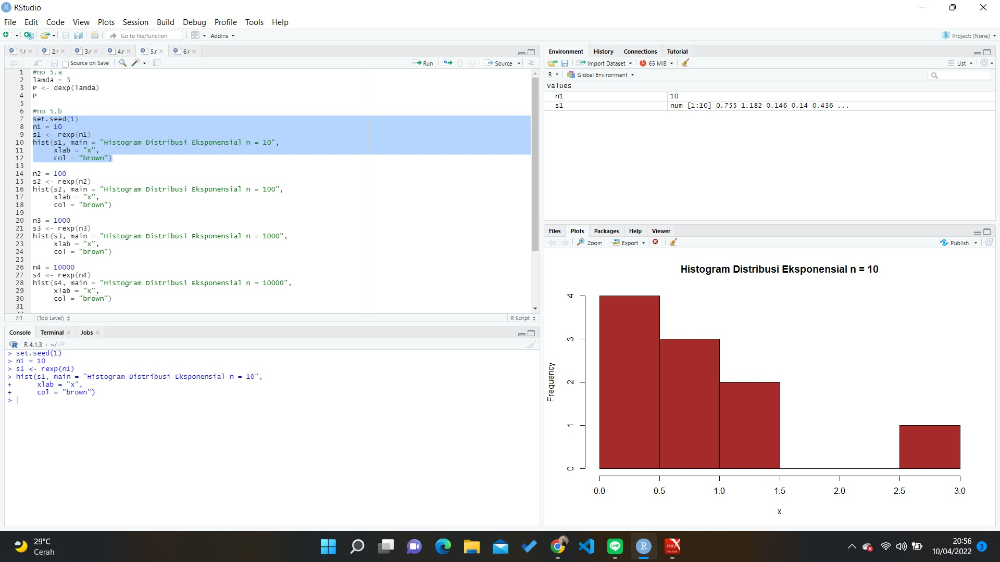
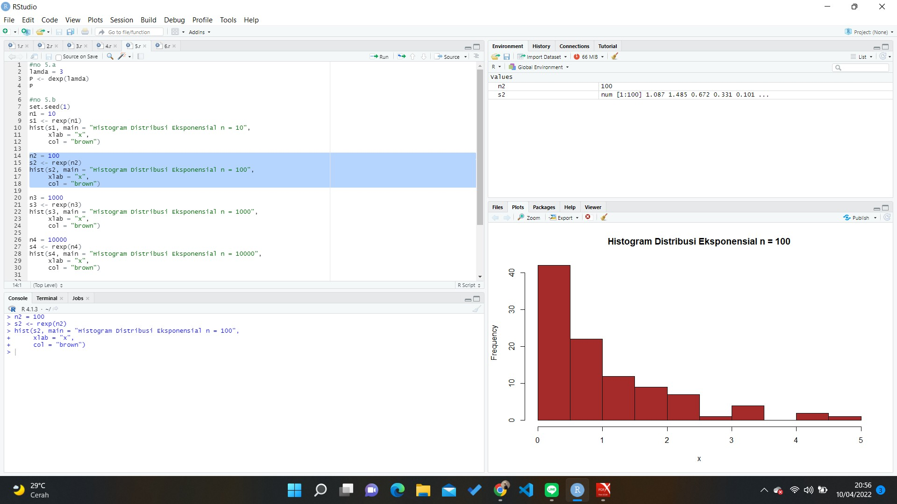
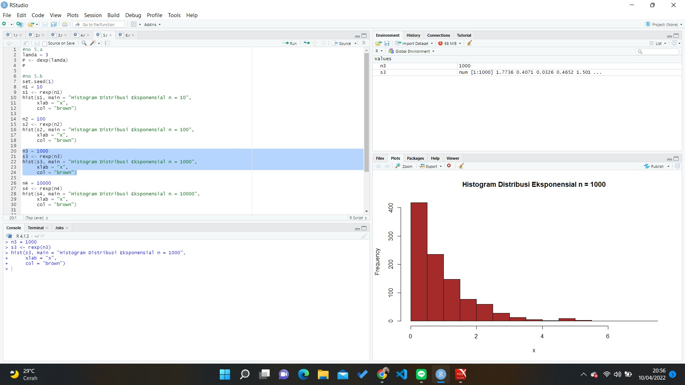
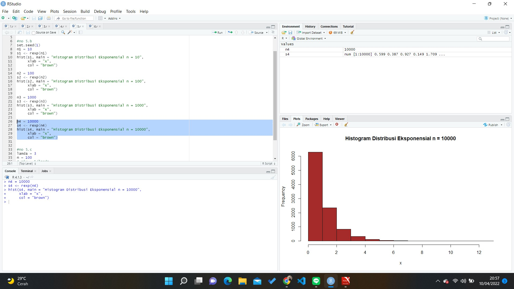

## 5.c
Nilai Rataan (μ) dan Varian (σ²) dari Distribusi Exponensial untuk n = 100 dan λ = 3

Dalam distribusi Eksponensial, `μ = 1/λ` dan `σ² = 1/(λ^2)`.

```R
#no 5.c
lamda = 3
n = 100
# miu = 1/lamda
miu = 1/lamda
miu
# taw^2 = 1/lamda^2
variance = 1/(lamda^2)
variance
```

### Hasil
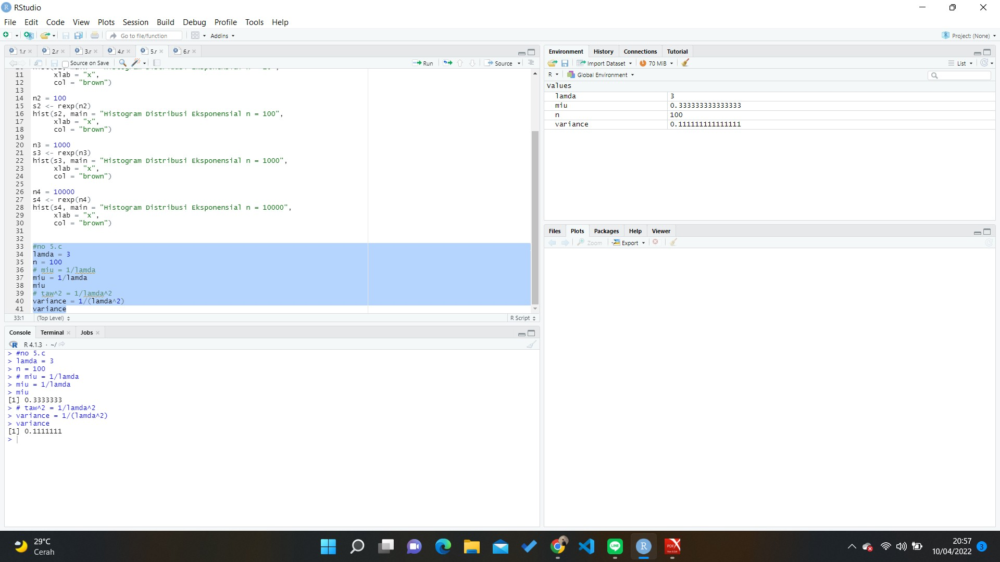

# Soal 6
Diketahui generate random nilai sebanyak 100 data, mean = 50, sd = 8. Tentukan

  a. Fungsi Probabilitas dari Distribusi Normal P(X1 ≤ x ≤ X2), hitung Z-Score Nya dan plot
  data generate randomnya dalam bentuk grafik. Petunjuk(gunakan fungsi plot()).
  
  Keterangan :
  
  X1 = Dibawah rata-rata
  
  X2 = Diatas rata-rata
  
  Contoh data :
  
  11
  
  1,2,4,2,6,3,10,11,5,3,6,8
  
  rata-rata = 5.083333
  
  X1 = 5
  
  X2 = 6
  
  b. Generate Histogram dari Distribusi Normal dengan breaks 50 dan format penamaan:
  NRP_Nama_Probstat_{Nama Kelas}_DNhistogram
  
  Contoh :
  
  312312312_Rola_Probstat_A_DNhistogram
  
  c. Nilai Varian (σ²) dari hasil generate random nilai Distribusi Normal.

## 6.a
Fungsi Probabilitas dari Distribusi Normal P(X1 ≤ x ≤ X2), hitung Z-Score Nya dan plot
  data generate randomnya dalam bentuk grafik. Petunjuk(gunakan fungsi plot()).
  
Untuk mengenerate data random digunakan fungsi `rnorm(n, μ, σ)`. 

Untuk mencari x1 dan x2 dilakukan perluangan pada dataset yang di sort, sehingga tau letak rata-rata ada diantara data nomor berapa.

Untuk Zscore memiliki rumus `ZScore = (x-μ)/σ`.

Untuk menampilkan plot digunakan fungsi `plot()`.
  
```R
n = 100
miu = 50
taw = 8

set.seed(1)
dataset <- rnorm(n, miu, taw)
dataset

temp = 0
for(i in sort(dataset)) {
  if(i < mean(dataset)) temp = temp + 1
}
x1 = sort(dataset)[temp]
x1
if(sort(dataset)[temp+1] == mean(dataset)) {
  x2 = sort(dataset)[temp+2]
} else {
  x2 = sort(dataset)[temp+1]
}
x2

# zscore = (x-miu)/taw
z1 = (x1-miu)/taw
z1
z2 = (x2-miu)/taw
z2

plot(dataset)
```

### Hasil
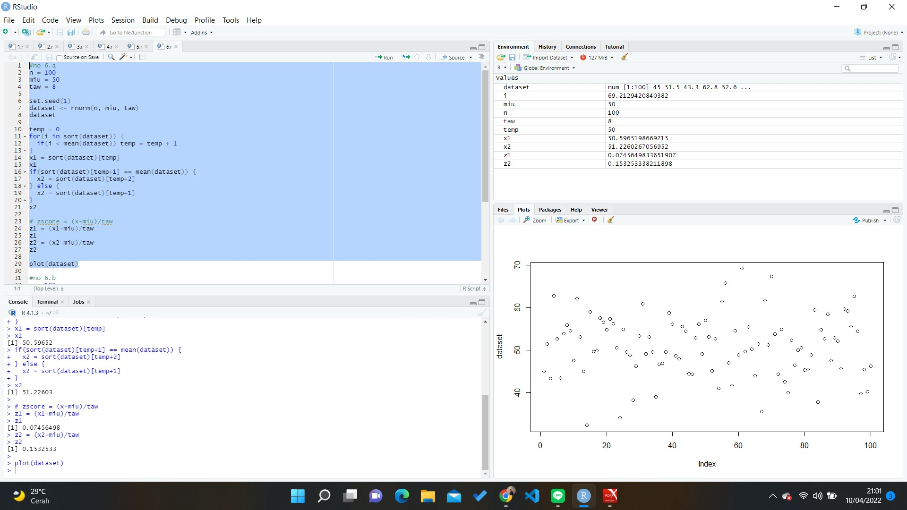

## 6.b
Generate Histogram dari Distribusi Normal dengan breaks 50 dan format penamaan:
  NRP_Nama_Probstat_{Nama Kelas}_DNhistogram
  
```R
#no 6.b
n = 100
miu = 50
taw = 8

set.seed(1)
dataset <- rnorm(n, miu, taw)
dataset
hist(dataset, breaks = 50,
     main = "5025201203_Syaiful Bahri Dirgantara_E_DNhistogram",
     col = "purple")
```

### Hasil
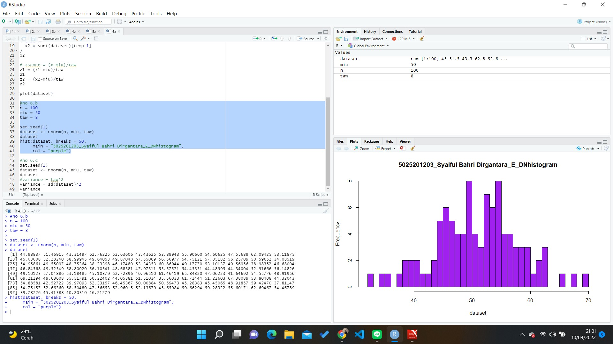

## 6.c
Nilai Varian (σ²) dari hasil generate random nilai Distribusi Normal.

Dalam distribusi Normal, variansi memiliki rumus `σ²`, sehingga diimplementasikan dengan `sd²`.

```R
#no 6.c
n = 100
miu = 50
taw = 8

set.seed(1)
dataset <- rnorm(n, miu, taw)
dataset
#variance = taw^2
variance = sd(dataset)^2
variance
```

### Hasil
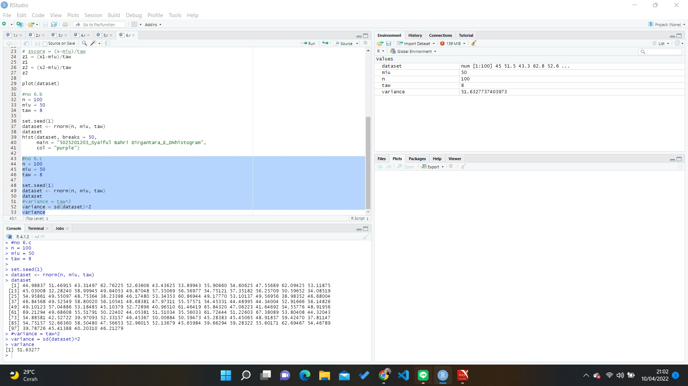
